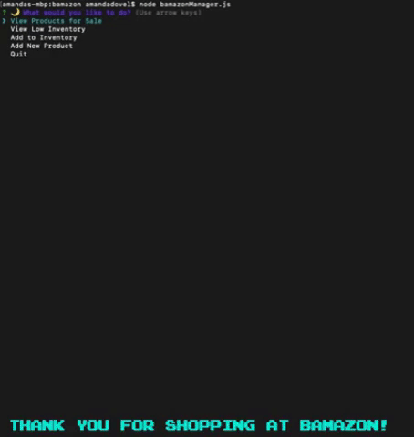
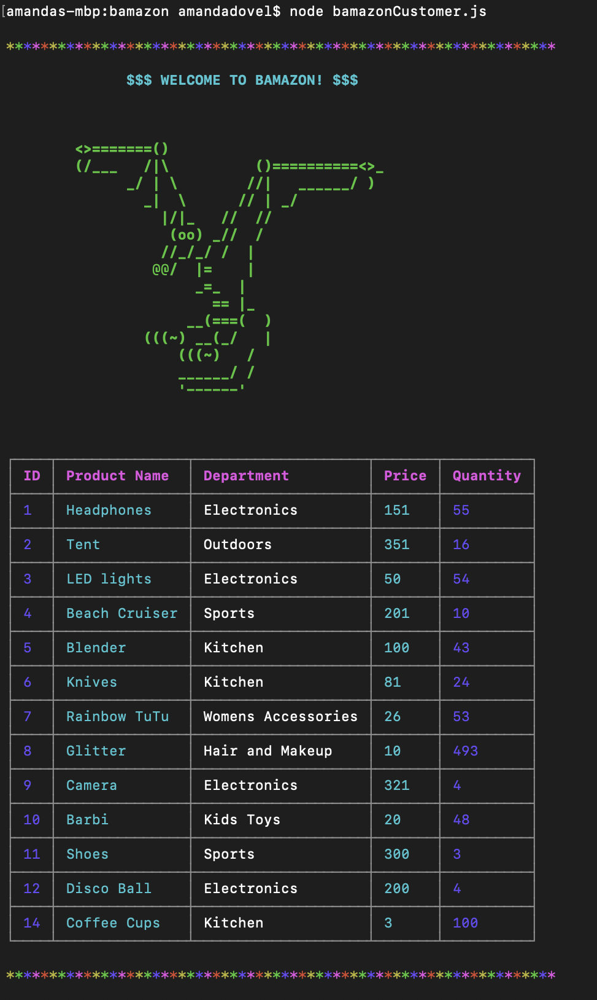
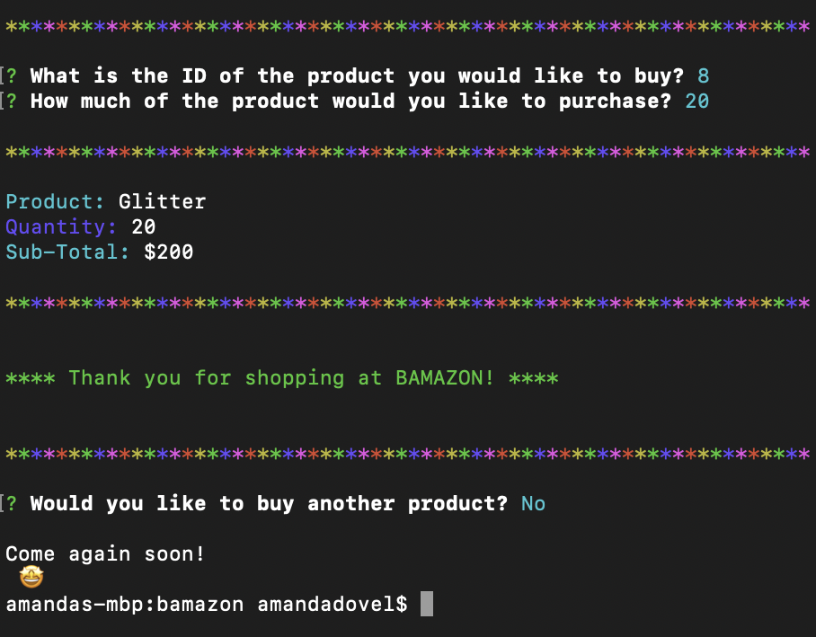
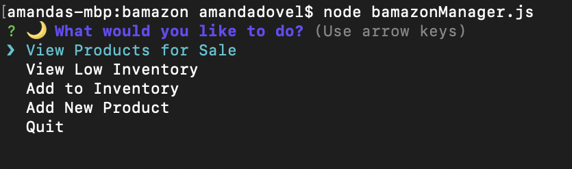
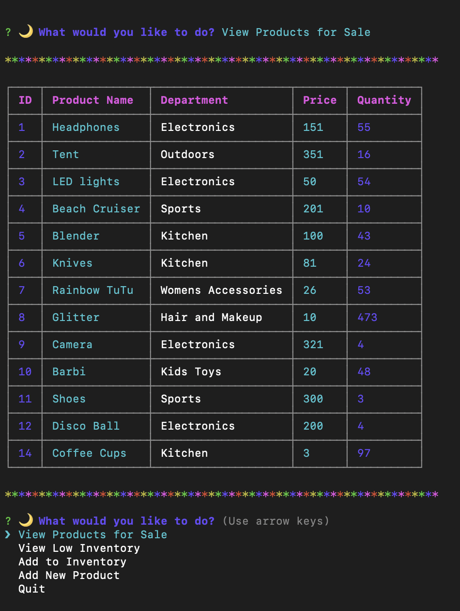
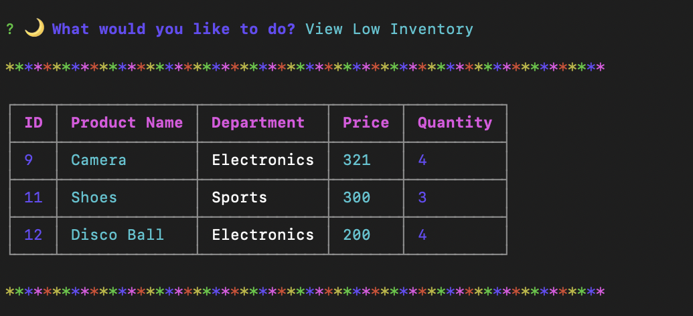
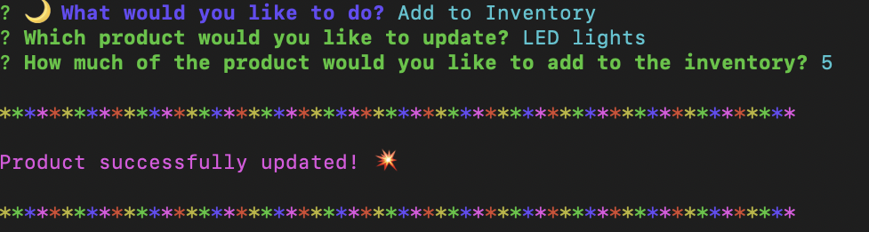
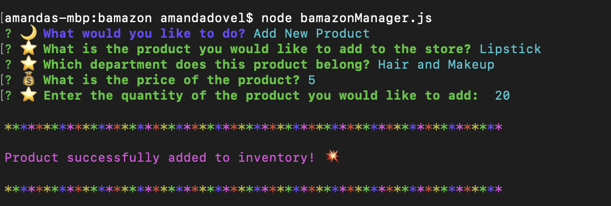

# bamazon 😀

This is an Amazon-like storefront using MYSQL. The app takes in orders from customers and depletes stock from the store's inventory. The customer will be shown table data and be given option to purchase items. The manager will be able to view inventory and update items. 



## Functionality 💪
#### Here's how the bamazon customer app works: 🛒
1. Show product table data 

`node bamazonCustomer.js`
    1.1. Product table data  

```
        var table = new Table({
            head: [colors.bold(colors.magenta('ID')), colors.bold(colors.magenta('Product Name')), colors.bold(colors.magenta('Department')), colors.bold(colors.magenta('Price')), colors.bold(colors.magenta('Quantity'))]
        });
        
        for (var i = 0; i < res.length; i++) {
            table.push([
                colors.blue(res[i].item_id),
                colors.cyan(res[i].product_name),
                res[i].department_name,
                colors.cyan(res[i].price),
                colors.blue(res[i].stock_quantity)
            ])
        }
```



2. What is the ID of the Product you would like to buy? 🎵

    2.1. How much of the Product would you like to buy?
```
function promptId() {
    inquirer.prompt([
        {
            name: "id",
            type: "input",
            message: "What is the ID of the product you would like to buy?"
        },
        {
            name: "quantity",
            type: "input",
            message: "How much of the product would you like to purchase?"
        }

    ])
        .then(function (answer) {
            var productId = parseInt(answer.id);
            var productQuantity = parseInt(answer.quantity);
            validateQuantity(productId, productQuantity);
        })
}
```



3. Check to see if there is enough quantity of the product

    3.1. If store does have enough product, decrease quantity by correct amount and reflect remaining amount. Then add user purchases and show total at checkout

```
function validateQuantity(id, quantity) {
    for (var i = 0; i < products.length; i++) {
        if (products[i].item_id === id) {
            if (products[i].stock_quantity >= quantity) {
                var newStock = products[i].stock_quantity - quantity;
                var price = products[i].price;
                var name = products[i].product_name;
                updateProduct(id, newStock, quantity, price, name);
            } else {
                console.log(colors.bold(colors.red("Sorry, there is not enough stock for your order!")));
                buyAgain();
            }
        }
    }
}

```

4. Buy again function

```
function buyAgain() {
    inquirer.prompt({
        type: "confirm",
        message: "Would you like to buy another product?",
        name: "buyAgain"
    })
        .then(function(res){
            if(res.buyAgain) {
                start();
            } else {
                console.log("\nCome again soon!\n", emoji.get('star-struck'));
                connection.end();
            }
        })
}
```

#### Here's how the bamazon manager app works: 👩‍💻
1. Prompt user asking what they would like to do

`node bamazonManager.js`

```
function beginningPrompt() {
    inquirer.prompt([
        {
            name: "select",
            type: "list",
            message: emoji.get('crescent_moon') + colors.blue( " What would you like to do?"),
            choices: ["View Products for Sale", "View Low Inventory", "Add to Inventory", "Add New Product", "Quit"]

        }
```



2. View products for sale 

    2.1. Display table 

```
function start() {
    connection.query("SELECT * FROM products", function (err, res) {
        console.log(stars);
        products = res;
        var table = new Table({
            head: [colors.bold(colors.magenta('ID')), colors.bold(colors.magenta('Product Name')), colors.bold(colors.magenta('Department')), colors.bold(colors.magenta('Price')), colors.bold(colors.magenta('Quantity'))]
        });

        for (var i = 0; i < res.length; i++) {
            table.push([
                colors.blue(res[i].item_id),
                colors.cyan(res[i].product_name),
                res[i].department_name,
                colors.cyan(res[i].price),
                colors.blue(res[i].stock_quantity)
            ])

        }

```



3. View Low Inventory

    3.1. Shows items with inventory lower than 5

```
function lowInventory() {
    connection.query("SELECT * FROM products", function (err, res) {
        console.log(stars);
        products = res;
        var table = new Table({
            head: [colors.bold(colors.magenta('ID')), colors.bold(colors.magenta('Product Name')), colors.bold(colors.magenta('Department')), colors.bold(colors.magenta('Price')), colors.bold(colors.magenta('Quantity'))]
        });

        for (var i = 0; i < res.length; i++) {
            if (res[i].stock_quantity < 5) {
                table.push([
                    colors.blue(res[i].item_id),
                    colors.cyan(res[i].product_name),
                    res[i].department_name,
                    colors.cyan(res[i].price),
                    colors.blue(res[i].stock_quantity)
                ])
            }
        }

```


4. Add to inventory

    4.1. Adds more items to existing inventory

```
function addInventory(product, quantity) {

    for (var i = 0; i < products.length; i++) {
        if (products[i].product_name === product) {
            var newQuantity = products[i].stock_quantity + quantity
        }
    }

    connection.query(
        "UPDATE products SET ? WHERE ?",
        [
            {
                stock_quantity: newQuantity
            },
            {
                product_name: product
            }
        ],
        function (err) {
            if (err) throw err;
            console.log(stars);
            console.log(colors.magenta("Product successfully updated!", emoji.get('boom')));
            console.log(stars);
            beginningPrompt();
        }
    )
}

```


5. Add a new product to the table 

```
function addProduct(product, department, price, quantity) {
    connection.query("INSERT INTO products SET ? ",{
        product_name: product,
        department_name: department,
        price: price,
        stock_quantity: quantity
    }, function(err, res) {
        if(err) throw err;
        console.log(stars);
        console.log(colors.magenta("Product successfully added to inventory!", emoji.get('boom')));
        console.log(stars);
        beginningPrompt();
    }
    )
}

```




## Getting Started 🏁

These instructions will get you a copy of the project up and running on your local machine for grading and testing purposes. 

1. Clone repository. Click on the clone button next to the repository (clone with SSH). 
2. Open Terminal and git clone (paste) into directory of your choice. 
3. Open folder in VS Code. 
4. Open `bamazonCustomer.js` to view customer logic.
5. Open `bamazonManager.js` to view manager logic.
6. `.gitignore` stores the node-modules needed for running the application but are kept hidden to avoid unneccessarily pushing them to github. 
7. `bamazon.sql` is where the table data is stored using MYSQL. 


## Pre-Requisites ✔️

1. Node - use this site to install node into your computer: https://nodejs.org/en/download/
    *to check if node is installed type node -v into your terminal. If installed it will print the version number on the screen.
2. NPM - Node Package Manager. Use this site to assist in downloading packages or modules: https://www.npmjs.com/
3. Install dependencies using `npm install` for inquirier, mysql, cli-table.
4. Used NPM install colors, node-emoji to add effects to terminal window


## Built With 🔧

* [MYSQL](https://www.mysql.com/) - Database management system
* [Node] (https://nodejs.org/en/download/) - As an asynchronous event driven JavaScript runtime, Node is designed to build scalable network applications. 
* [Javascript] (https://www.javascript.com/) -JavaScript is the programming language of HTML and the Web

## Author ⌨️
*** Amanda Dovel *** - [amandadovel](https://github.com/amandadovel)

## Acknowledgments 🌟

* Amber Burroughs, Tutoring badass